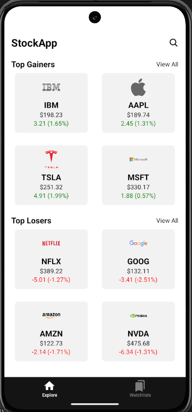
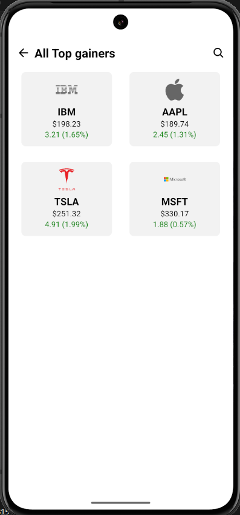
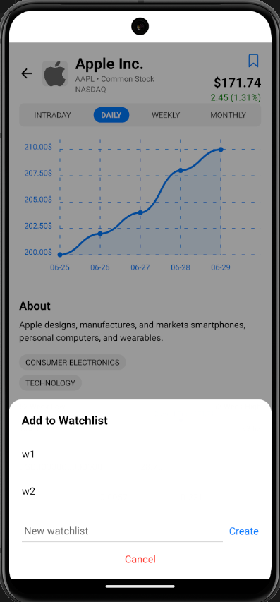
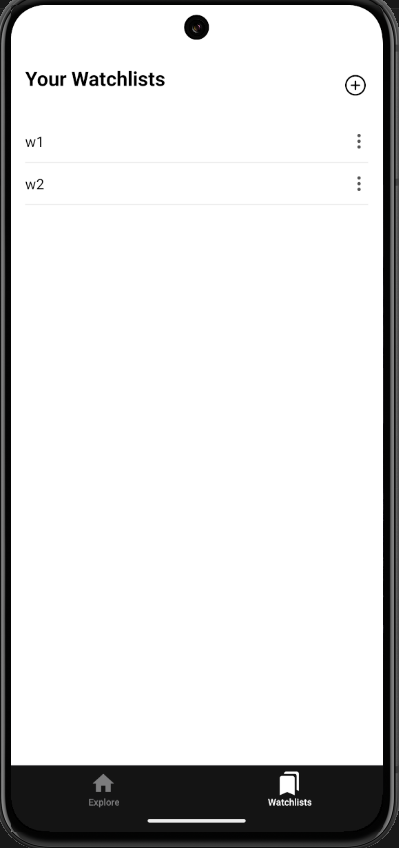
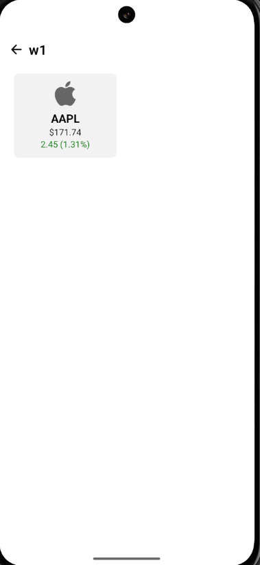

---


# 📈 StocksApp — React Native Application

## 🧩 Overview

**StocksApp** is a mobile stock market application built using **React Native**, **TypeScript**, and **Expo Router**. It allows users to:

- Explore Top Gainers and Losers
- View detailed stock analytics
- Visualize time series graphs (1D, 1W, 1M)
- Manage multiple watchlists
- Add/remove stocks from watchlists using a modal


## 📂 Directory Structure

<!-- 
StocksApp/ -->
<!-- ├── app/
│   ├── (tabs)/
│   │   ├── _layout.tsx          # Tabs layout
│   │   ├── explore.tsx          # Explore screen
│   │   └── watchlists.tsx       # Watchlist overview tab
│   ├── stock/
│   │   └── [id].tsx             # Stock detail screen (Dynamic route)
│   ├── view-all/
│   │   └── [type].tsx           # View all gainers/losers
│   ├── watchlist/
│   │   └── [id].tsx             # Watchlist details page
│   ├── _layout.tsx             # Root layout for nested stacks
│   └── +not-found.tsx          # Not found fallback screen
├── components/
│   └── StockCard.tsx           # Reusable stock card component
├── services/
│   ├── api.ts                  # API calls to Alpha Vantage
│   ├── cache.ts                # Caching utilities (if used)
│   ├── mockData.ts             # Offline mock data
│   └── WatchlistContext.tsx    # Context for managing watchlists
├── types/
│   ├── MarketMoversResponse.ts # Interfaces for API responses
│   └── Ticker.ts               # Stock ticker type definition -->


## 🔑 Features

- 🔍 **Search** top stocks by ticker
- 📈 **Toggleable Time Series**: 1D / 1W / 1M 
- 📌 **Add to Watchlist** via modal
- 💬 **Mock Data Enabled** via `USE_MOCK_DATA = true`
- 📊 **Dynamic Price Graphs**
- 🧠 **Context API** for global state (Watchlists)
- 📱 Responsive and mobile-optimized design


## ⚙️ Technologies

- React Native + Expo
- TypeScript
- Expo Router
- ChartKit (`react-native-chart-kit`)
- `@expo/vector-icons`
- Alpha Vantage API for stock information
- API ninjas for stock logos.


## 🚀 Setup & Run

```bash
npm install
npm run android
````

To enable mock data:

```ts
// In services/api.ts
const USE_MOCK_DATA = true;
```


## 📚 Folder Highlights

* `app/(tabs)/`: Contains bottom tab screens like Explore and Watchlists
* `app/view-all/`: View all gainers/losers via `[type].tsx`
* `app/stock/[id].tsx`: Full stock detail with graph, metrics, and watchlist modal
* `services/`: Centralized API, cache, and mock logic
* `types/`: Strict typing for Ticker and API responses

---

## 🔒 Watchlist Functionality

* Add/Remove stocks from modal
* Create new watchlists on-the-fly
* Store watchlists in global Context
* Bookmark icon toggles watchlist modal

---

## 🧪 Time Series Graphs

* Floating tab to switch between intervals
* Example mock data used for all stocks:

  * `INTRADAY`
  * `DAILY`
  * `WEEKLY`
  * `MONTHLY`

---

## 📸 UI Components

### 🔍 Explore Page
- This is the main screen of the app showing top gainers and losers with search functionality.


---

### 📈 View All Gainers/Losers
- Tapping "View All" on gainers or losers shows the full list of that category.


---

### 📊 Stock Details Page
Displays detailed information about a selected stock including:
- Name, symbol, exchange
- Real-time price and % change
- Time series graph with 1D to 1Y toggle
- Analyst target, 52-week range with current indicator
- Sector/industry tags and market metrics


---

### 📌 Add to Watchlist Modal
Clicking the bookmark icon shows a modal to:
- Select an existing watchlist
- Create a new watchlist


---

### 📋 Watchlists Overview
- Shows a list of all created watchlists.
- Each watchlist is tappable to view its stocks.


---

### 📂 Stocks Inside a Watchlist
- Displays all bookmarked stocks under the selected watchlist.
- Each stock can be tapped to view its details.



---


